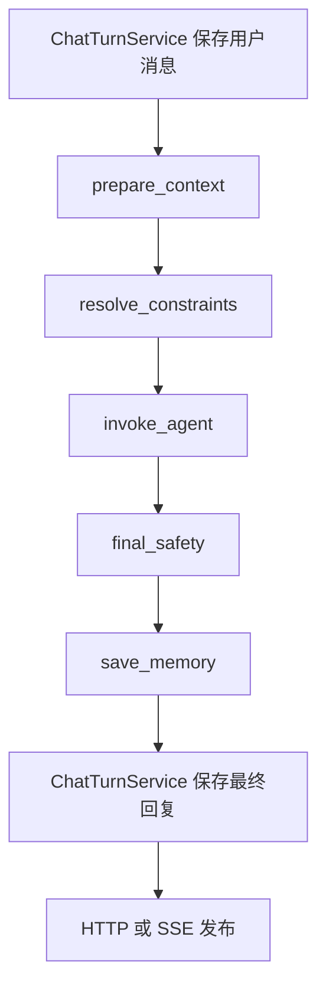
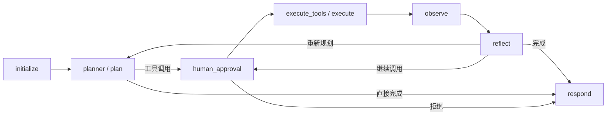

# Workflow 与食谱 Agent 的边界

本次改造保留模块化单体的部署方式。Workflow 和 Agent 是可以分别构建、测试和替换的应用系统；它们不互相导入实现，通过 `application/ports/agent.py` 和 `application/contracts` 中的契约通信。当前由 service/composition 注入本地 Agent；以后可以用实现同一接口的远程客户端替换，节点无需改动。

## 目录职责

```text
safemeal/application/
  contracts/                 跨节点、跨系统的消息、状态、参数和结果
  ports/                     数据库、模型、Agent、检索等能力接口
  service/                   应用业务能力
    chat/                    会话与消息持久化、聊天入口服务
    memory/                  长期记忆管理
    recipes/                 食谱查询、推荐、生成和饮食类型过滤
    dietary_safety/          过敏约束抽取、证据分类、生成校验和回答组织
    knowledge/               知识检索、分块和索引业务
    upload/                  上传保存和文档入库业务
    composition/             基础设施配置、对象装配和资源生命周期
  workflow/
    graph.py                 只组装节点与边
    runner.py                Workflow 公共入口
    context/                 历史窗口与记忆选择
    nodes/                   准备上下文、约束解析、Agent 调用、复核等
  agent/
    graph.py                 只组装 Agent 节点与边
    routing.py               Agent 循环分支
    execution_service.py     独立执行、超时、预算、checkpoint 恢复
    tool_registry.py         工具注册和启用清单校验
    tool_policy.py           调用审核、硬约束注入
    tool_runtime.py          参数校验调度、超时、并发限制
    nodes/                   初始化、规划、执行、观察、反思、审批、回答
  tool/                      仅放具体工具适配器
```

基础设施实现继续放在 `infrastructure/`。除基础设施内部互相引用外，只有 `application/service/composition/` 可以导入这些具体实现。Workflow、Agent 和工具只依赖契约、能力接口或不绑定基础设施的业务服务。数据库连接配置、LLM 参数和图查询客户端由 composition 装配；HTTP 入口通过 composition 获取业务服务。业务服务不能反向导入 composition 或全局运行配置。

`service` 负责业务能力，`workflow` 负责聊天流程中的调用顺序，`agent` 负责动态工具决策。原来的 `use_cases` 已合并进 service，不保留转发模块或第二套实现。

`ports` 只定义所需能力，例如数据库仓储、模型、Agent 和上传队列接口；`contracts` 只定义数据。composition 创建 infrastructure 实现并注入业务服务，业务服务通过 ports 调用，不负责创建数据库或模型客户端。service 包入口不导入 composition，单独使用业务服务无需加载部署配置。

原 `modules/` 已删除。食谱、记忆与安全判定的数据模型统一放在 `application/contracts`；饮食安全、筛选和记忆抽取规则放在 `application/service`。模型保留字段校验、数量归一化和结构不变量；跨食材的匹配、过滤与业务决策由 service 执行，contracts 不依赖 service。

## 聊天流程



- `ChatTurnService` 只负责创建/检查会话、保存用户消息和最终回复，不读取历史。`prepare_context` 通过 `AgentContextBuilder` 调用 `ConversationHistoryService`，按当前用户消息的 `order_index` 读取严格早于本轮的历史，再加载记忆并整理窗口。消息锚点同时验证用户和会话归属。
- 内部无持久化消息的调用沿用显式传入的 history/context；关闭长期记忆不影响历史准备。审批恢复沿用 checkpoint 的原始上下文，不重新加载最新记忆。
- 本轮事实在最终记忆节点处理，避免读取阶段修改长期偏好。
- 过敏、忌口记忆单独完整读取；相关性限制只用于软偏好。
- 当前消息、历史和长期记忆合并为 `DietaryRequirements`，分别保存 allergies、restrictions、preferences。`dietary_constraints` 是兼容现有工具的硬限制投影。
- Workflow 不分类也不按意图决定是否调用 Agent。Agent 的 `planner` 首次运行时调用同目录 `intent.py`：明确意图使用规则，模糊请求在模型支持时使用 `IntentClassifier`，失败返回固定澄清模板。重新规划复用本轮意图。
- `IntentDecision` 属于 `contracts/agent/intent.py`，Agent 将其随响应返回。最终复核同时检查食谱卡片和食谱工具证据；标为 knowledge/clarify/memory 也不能绕过实际食谱证据复核。缺失意图与证据的普通草稿不会作为食谱推荐发布。
- 临时、假设、第三方表达保守地留在本轮上下文，不自动写入本人长期记忆。过敏撤销要求通过记忆管理明确变更。
- 最终复核依据 Agent 返回的原始结构化食谱证据重新计算，不信任 Agent 自报的 `safe` 状态。
- 有硬约束时，最终正文由确定性安全结果组织；没有足够证据时返回说明，不发布具体安全推荐。这个策略优先保证约束，可能限制自由形式的知识回答。
- 复核失败在本轮返回证据不足。补查与修正使用 Agent 已有预算循环；外层不会再启动无限重试。
- 公共聊天进入统一 Workflow；内部 process/process-stream HTTP 入口已删除。审批恢复经过独立恢复图，并复用约束和最终安全节点。

## 独立 Agent



保留原图的节点名称，以减少已有 checkpoint 的迁移风险。`planner`、`execute_tools`、`observe` 分别承担 plan、execute、observe 职责。`reflect` 保留证据充分性和预算判断。所有节点实现在 `nodes/`，图文件中没有内联节点函数。

Agent 不加载或写入用户数据库记忆，也不调用 Workflow。独立调用时仍可从输入上下文整理约束，这是独立运行所需的输入校验，不是重复的聊天编排。

## 工具与安全

具体工具位于 `application/tool`：食谱查询、详情、推荐、生成、向量检索和饮食图查询。工具参数、返回值统一位于 contracts，后端能力通过 ports 注入。

工具注册、未知名称检查和重复名称检查由 Agent 注册表及运行时负责。每次执行前经过 `tool_policy`：

1. 将可信过敏约束合并进食谱工具参数，模型不能删除这些约束。
2. 校验参数形状，拒绝不合法输入。
3. 需要审批的生成调用会暂停；反思节点产生的新调用也回到审批节点。

安全层次包括检索参数过滤、生成食谱校验、观察节点校验和 Workflow 出口复核。这些复核服务于不同边界，保留共同的领域规则，避免复制规则实现。

同名候选会合并证据，后续出现禁忌食材不能被首条结果遮蔽。食谱证据不会在安全判断前截断。生成食谱同时检查食材和步骤，并区分“加入某食材”与“不要加入某食材”。规则检查不等于对真实食品或加工过程作绝对安全保证。

## 输出与持久化

Agent 的草稿流在 Workflow 内被抑制；前端可以接收 `progress` 状态，但只有最终复核且聊天保存成功后才接收 `answer`。`done` 中包含已复核的食谱、状态和元数据。被拦截的食谱也会从卡片及旧的 `generated_recipe` 元数据中清除。

`evidence` 是 Agent 向 Workflow 提交的契约字段，Workflow 发布结果前清除该内部证据载荷。

契约目录移动后，checkpoint serializer 会映射旧的 shared/contracts 类型路径到新路径，不需要保留旧实现文件或删除 checkpoint。同步 PostgreSQL saver 通过线程适配器支持异步图执行。正式 PostgreSQL 连通性仍需要在部署环境验证。

## 已移除的旧实现位置

- `application/use_cases/{chat,memory,recipes,knowledge,upload}` → `application/service/` 对应业务目录
- 原 `application/service/` 的容器、工厂和运维装配 → `application/service/composition/`
- 原上传用例中的 `ingestion_queue.py` 接口 → `application/ports/ingestion/ingestion_queue.py`

- `bootstrap/application_container.py` → `application/service/composition/application_container.py`
- `application/agent/context` → `application/workflow/context`
- `AgentRequestService`、内部 process HTTP 入口及其 request_mapping 已删除；公共聊天通过 ChatTurnService 调用 Workflow，审批恢复通过 chat/resume 进入 Workflow
- `shared/contracts` → `application/contracts`
- `application/agent/utils/state.py` → `application/contracts/agent/state.py`
- `infrastructure/tools` 中的具体工具、注册表和执行器 → application 对应目录
- infrastructure 中的向量、图查询工具包装 → `application/tool`
- `recipe_generation_routing.py` 的重复关键词分类 → Workflow 意图契约与 Agent 工具决策

原有已暂存删除的测试文件保持不变，新测试位于 `tests/refactor`。

## 验证

```bash
python -m pytest tests/refactor -q
python -m ruff check safemeal tests/refactor
python -m mypy safemeal
python -m compileall -q safemeal
npm --prefix web run build
```

测试覆盖基础设施只从 composition 导入、业务服务不反向依赖装配或全局配置、旧用例目录移除、节点独立性、DTO 归属、无配置的核心系统导入、独立 Agent 执行、审批与恢复、安全约束注入、最终复核、流式发布与持久化失败、记忆范围，以及旧 checkpoint 类型兼容。

本次验证使用测试替身和本地 checkpoint，不会调用付费模型或外部数据库。生产 MySQL、Neo4j、Milvus 和 PostgreSQL 的联调需要对应环境与凭据；仓库本身没有提供已配置的运行环境。

## 数据契约目录

`application/contracts` 按职责归档，包入口不聚合导入。调用方从具体模块导入，所有目录只声明数据类型，不包含服务实现或工具注册逻辑。

| 目录 | 职责 |
| --- | --- |
| `agent/` | Agent 调用输入输出、上下文、图状态、规划/观察决策、提示词数据 |
| `workflow/` | Workflow 请求、意图、节点状态和进度事件 |
| `conversation/` | Agent、Workflow 和聊天共享的消息、来源及路由信息 |
| `chat/` | 会话与消息管理、单轮聊天请求响应 |
| `recipes/` | 食谱模型、生成候选、查询请求和搜索结果 |
| `dietary_safety/` | 约束、食材证据与安全判定数据 |
| `tools/` | 工具规格、执行结果和各工具参数；不包含工具实现 |
| `memory/` | 用户记忆读写契约 |
| `upload/` | 上传、解析、文档摄取任务及分块策略名称 |

AgentContext 是提供给 Agent 的边界输入，AgentContextPatch 是组装该输入时的局部数据，因此一起保留在 `agent/context.py`。Workflow 引用 Agent 的调用契约，不引用其实现。旧目录不保留兼容代码副本；checkpoint 反序列化器将历史类路径映射到新模块，并保持用户文本不变。

## 评测与监控清理

已移除独立评测 CLI、数据集、LLM Judge、Trace 采集与查询、OpenTelemetry/LLMOps 上报及相关部署配置。内部 Agent 请求不再支持 `include_trace`，`/api/v1/observability` 路由已移除。

`application/streaming.py` 保留面向用户的答案与流程进度传输；`application/runtime_budget.py` 只在执行期间累计 Token 和成本以限制循环，不保留提示词、回答、调用轨迹或上报数据。预算配置继续使用 MODEL_PRICING_JSON 和 AGENT_MAX_COST。请求 ID 用于聊天幂等，健康检查和普通错误日志保留。

## 原 modules 职责迁移

逐个审阅后确认原目录没有数据库、文件、网络或 LLM 调用，因此没有需要新增到 infrastructure 的实现。现有数据库、模型、检索适配器保持在 infrastructure，仅更新其导入。

| 原文件 | 新位置（safemeal/ 下） |
| --- | --- |
| recipe_catalog/recipe_models.py | application/contracts/recipes/models.py |
| recipe_catalog/generated_recipe.py | application/contracts/recipes/generated.py；食材匹配移到生成业务服务 |
| recipe_catalog/dietary_filter.py | application/service/recipes/dietary_filter.py |
| user_memory/memory_models.py | application/contracts/memory/extraction.py |
| user_memory/memory_extraction.py | application/service/memory/memory_extraction.py |
| dietary_safety/dietary_constraints.py | 类型拆到 application/contracts/dietary_safety/constraints.py，规则到 application/service/dietary_safety/constraints.py |
| dietary_safety/recipe_safety.py | 类型拆到 application/contracts/dietary_safety/models.py，规则到 application/service/dietary_safety/recipe_safety.py |
| dietary_safety/ingredient_terms.py | application/service/dietary_safety/ingredient_terms.py |
| dietary_safety/generated_safety.py | application/service/dietary_safety/generated_safety.py |
| dietary_safety/answer.py | application/service/dietary_safety/answer.py |

不保留旧模块转发或重复实现。历史 checkpoint 中的旧模型路径由反序列化映射兼容。

食谱业务统一由 `application/service/recipes/recipe_service.py` 的 `RecipeService` 提供 `search`、`get`、`recommend`、`generate`。Agent 工具共享容器中的服务实例。未启用模型时仍可查询已有食谱，生成调用则返回功能未启用错误。

## 偏好与过敏的统一流程（当前实现）

输入、用户历史和长期记忆 → `DietarySafetyService.resolve_constraints()` → `DietaryRequirements` → Agent/LLM → 结构化食谱与证据 → `DietarySafetyService.review_recipes()` → Workflow 发布。

`DietaryRequirements` 分别保存 allergies（过敏）、restrictions（明确禁忌）、preferences（偏好和本轮要求）。偏好记录来源及 required 标志：普通偏好只影响满足度和排序，required 要求影响是否允许推荐。当前输入覆盖同维度的历史软偏好；过敏与禁忌保守合并，不能通过一句否认静默解除已有档案。

Workflow 保存独立审核快照，向 Agent 传递深复制的上下文；Agent 不重复解释已有快照。独立调用 Agent 时由同一解析服务补全。审批恢复使用 checkpoint 保存的要求。旧 dietary_constraints 字段作为工具硬排除的兼容投影保留，不再作为第二套业务抽取结果。

Agent 的 task_context 将要求传入模型，独立提示消息避免被证据摘要截断；执行前把支持的硬要求注入查询/生成参数。生成工具还将偏好传给生成模型。

所有推荐、详情、替换及生成结果（包括没有过敏记录的请求）都需要可核验的结构化食谱证据。最终返回 metadata.recipe_reviews：每道菜的 passed/excluded/unknown、过敏/禁忌状态、偏好满足度，以及逐项判断。口味与设备是可选证据字段，数据库中没有这些数据时不猜测；明确要求无法验证则暂不推荐，普通偏好无法验证则单独说明。生成候选卡片也参与复核，不能绕过文字回复门禁。纯知识问答且没有食谱候选时保留知识回答。

自然语言抽取目前是保守规则，覆盖常见口味、食材喜恶、时间、饮食类型与设备；不是任意语义的完整理解器。长期记忆中无法结构化的偏好按 other 保留并标记无法确认。数量单位与结构不变量仍在契约模型中校验。


## HTTP 业务范围

业务 router 保留 `auth.py`、`chat.py` 与 `knowledge.py`。身份路由提供注册、登录、令牌轮换、退出和当前账号查询；聊天包含会话管理、历史、明确的饮食记忆纠正和审批恢复；知识库只提供文件入库与文件管理。接口清单和旧接口迁移见 [http-api.md](http-api.md)。Agent、记忆、知识检索仍作为内部应用能力存在，不以独立 router 暴露。基本存活和就绪探针保留。
