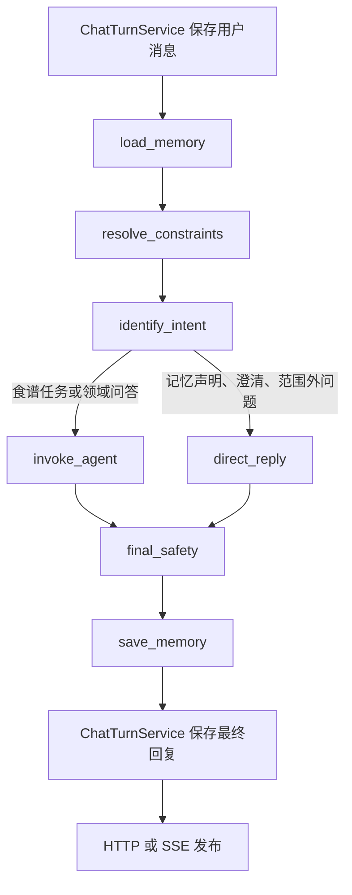
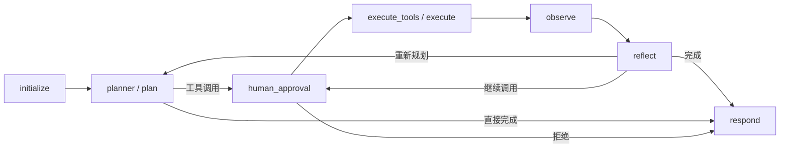

# Workflow 与食谱 Agent 的边界

本次改造保留模块化单体的部署方式。Workflow 和 Agent 是可以分别构建、测试和替换的应用系统；它们不互相导入实现，通过 `application/ports/agent.py` 和 `application/contracts` 中的契约通信。当前由 service/composition 注入本地 Agent；以后可以用实现同一接口的远程客户端替换，节点无需改动。

## 目录职责

```text
safemeal/application/
  contracts/                 跨节点、跨系统的消息、状态、参数和结果
  ports/                     数据库、模型、Agent、检索等能力接口
  service/                   应用业务能力
    chat/                    会话与消息持久化、聊天入口服务
    memory/                  长期记忆管理
    recipes/                 食谱查询、推荐和生成业务
    knowledge/               知识检索、分块和索引业务
    upload/                  上传保存和文档入库业务
    composition/             基础设施配置、对象装配和资源生命周期
  workflow/
    graph.py                 只组装节点与边
    routing.py               业务分支
    runner.py                Workflow 公共入口
    context/                 历史窗口与记忆选择
    nodes/                   加载记忆、约束解析、意图、Agent 调用、复核等
  agent/
    graph.py                 只组装 Agent 节点与边
    routing.py               Agent 循环分支
    execution_service.py     独立执行、超时、预算、checkpoint 恢复
    tool_registry.py         工具注册和启用清单校验
    tool_policy.py           调用审核、硬约束注入
    tool_runtime.py          参数校验调度、超时、调用追踪
    nodes/                   初始化、规划、执行、观察、反思、审批、回答
  tool/                      仅放具体工具适配器
```

基础设施实现继续放在 `infrastructure/`。除基础设施内部互相引用外，只有 `application/service/composition/` 可以导入这些具体实现。Workflow、Agent 和工具只依赖契约、能力接口或不绑定基础设施的业务服务。数据库连接配置、LLM 参数和图查询客户端由 composition 装配；HTTP 入口通过 composition 获取业务服务。业务服务不能反向导入 composition 或全局运行配置。

`service` 负责业务能力，`workflow` 负责聊天流程中的调用顺序，`agent` 负责动态工具决策。原来的 `use_cases` 已合并进 service，不保留转发模块或第二套实现。

`ports` 只定义所需能力，例如数据库仓储、模型、Agent 和上传队列接口；`contracts` 只定义数据。composition 创建 infrastructure 实现并注入业务服务，业务服务通过 ports 调用，不负责创建数据库或模型客户端。service 包入口不导入 composition，单独使用业务服务无需加载部署配置。

领域规则仍在 `modules/`，例如食材归一化、食谱领域模型、确定性饮食安全判断。领域模型没有仅为目录统一而复制到 contracts。

## 聊天流程



- 加载阶段读取历史和已有记忆；本轮事实在最终记忆节点处理，避免读取阶段修改长期偏好。
- 过敏、忌口记忆单独完整读取；相关性限制只用于软偏好。
- 当前消息、历史和长期记忆合并为显式 `dietary_constraints`；本轮偏好放在 `user_profile`。Agent 从该契约消费任务信息。
- 明确意图使用本地规则；含糊的菜名查询、多轮表达和领域归属使用独立的 `IntentClassifier` 能力，输出受约束的意图契约。分类失败返回固定澄清模板。
- 临时、假设、第三方表达保守地留在本轮上下文，不自动写入本人长期记忆。过敏撤销要求通过记忆管理明确变更。
- 最终复核依据 Agent 返回的原始结构化食谱证据重新计算，不信任 Agent 自报的 `safe` 状态。
- 有硬约束时，最终正文由确定性安全结果组织；没有足够证据时返回说明，不发布具体安全推荐。这个策略优先保证约束，可能限制自由形式的知识回答。
- 复核失败在本轮返回证据不足。补查与修正使用 Agent 已有预算循环；外层不会再启动无限重试。
- 公共聊天、内部 process/process-stream 和 MCP 食品安全查询都进入同一 Workflow。审批恢复经过独立恢复图，并复用约束和最终安全节点。

## 独立 Agent



保留原图的节点名称，以减少已有 checkpoint 的迁移风险。`planner`、`execute_tools`、`observe` 分别承担 plan、execute、observe 职责。`reflect` 保留证据充分性和预算判断。所有节点实现在 `nodes/`，图文件中没有内联节点函数。

Agent 不加载或写入用户数据库记忆，也不调用 Workflow。独立调用时仍可从输入上下文整理约束，这是独立运行所需的输入校验，不是重复的聊天编排。

## 工具与安全

具体工具位于 `application/tool`：食谱查询、详情、推荐、生成、向量检索、饮食图查询和外部 MCP。工具参数、返回值统一位于 contracts，后端能力通过 ports 注入。

工具注册、未知名称检查和重复名称检查由 Agent 注册表及运行时负责。每次执行前经过 `tool_policy`：

1. 将可信过敏约束合并进食谱工具参数，模型不能删除这些约束。
2. 校验参数形状，拒绝不合法输入。
3. 外部 MCP 调用需要审批；反思节点产生的新调用也回到审批节点。

安全层次包括检索参数过滤、生成食谱校验、观察节点校验和 Workflow 出口复核。这些复核服务于不同边界，保留共同的领域规则，避免复制规则实现。

同名候选会合并证据，后续出现禁忌食材不能被首条结果遮蔽。食谱证据不会在安全判断前截断。生成食谱同时检查食材和步骤，并区分“加入某食材”与“不要加入某食材”。规则检查不等于对真实食品或加工过程作绝对安全保证。

## 输出与持久化

Agent 的草稿流在 Workflow 内被抑制；前端可以接收 `progress` 状态，但只有最终复核且聊天保存成功后才接收 `answer`。`done` 中包含已复核的食谱、状态和元数据。被拦截的食谱也会从卡片及旧的 `generated_recipe` 元数据中清除。

`evidence` 是 Agent 向 Workflow 提交的契约字段，Workflow 发布结果前清除该内部证据载荷。显式请求完整 trace 的受信任调试接口仍可查看执行轨迹。

契约目录移动后，checkpoint serializer 会映射旧的 shared/contracts 类型路径到新路径，不需要保留旧实现文件或删除 checkpoint。同步 PostgreSQL saver 通过线程适配器支持异步图执行。正式 PostgreSQL 连通性仍需要在部署环境验证。

## 已移除的旧实现位置

- `application/use_cases/{chat,memory,recipes,knowledge,upload}` → `application/service/` 对应业务目录
- 原 `application/service/` 的容器、工厂和运维装配 → `application/service/composition/`
- 原上传用例中的 `ingestion_queue.py` 接口 → `application/ports/ingestion/ingestion_queue.py`

- `bootstrap/application_container.py` → `application/service/composition/application_container.py`
- `application/agent/context` → `application/workflow/context`
- `AgentRequestService` 已删除；请求映射在 `interfaces/http/request_mapping.py`，HTTP 接口直接调用 `workflow/runner.py` 中的 `ChatWorkflow`
- `shared/contracts` → `application/contracts`
- `application/agent/utils/state.py` → `application/contracts/agent/state.py`
- `infrastructure/tools` 中的具体工具、注册表和执行器 → application 对应目录
- infrastructure 中的向量、图查询工具包装 → `application/tool`
- `recipe_generation_routing.py` 的重复关键词分类 → Workflow 意图契约与 Agent 工具决策

原有已暂存删除的测试文件保持不变，新测试位于 `tests/refactor`。

## 验证

```bash
python -m pytest tests/refactor -q
python -m ruff check safemeal tests/refactor
python -m mypy safemeal
python -m compileall -q safemeal
npm --prefix web run build
```

测试覆盖基础设施只从 composition 导入、业务服务不反向依赖装配或全局配置、旧用例目录移除、节点独立性、DTO 归属、无配置的核心系统导入、独立 Agent 执行、审批与恢复、安全约束注入、最终复核、流式发布与持久化失败、记忆范围，以及旧 checkpoint 类型兼容。

本次验证使用测试替身和本地 checkpoint，不会调用付费模型或外部数据库。生产 MySQL、Neo4j、Milvus 和 PostgreSQL 的联调需要对应环境与凭据；仓库本身没有提供已配置的运行环境。

## 数据契约目录

`application/contracts` 按职责归档，包入口不聚合导入。调用方从具体模块导入，所有目录只声明数据类型，不包含服务实现或工具注册逻辑。

| 目录 | 职责 |
| --- | --- |
| `agent/` | Agent 调用输入输出、上下文、图状态、规划/观察决策、提示词数据 |
| `workflow/` | Workflow 请求、意图、节点状态和进度事件 |
| `conversation/` | Agent、Workflow 和聊天共享的消息、来源及路由信息 |
| `chat/` | 会话与消息管理、单轮聊天请求响应 |
| `recipes/` | 食谱查询、搜索结果及生成请求 |
| `tools/` | 工具规格、执行结果和各工具参数；不包含工具实现 |
| `memory/` | 用户记忆读写契约 |
| `upload/` | 上传、解析、文档摄取任务及分块策略名称 |
| `observability/` | Trace、Token 用量和成本数据 |
| `evaluation/` | 评测样本、配置和报告 |

AgentContext 是提供给 Agent 的边界输入，AgentContextPatch 是组装该输入时的局部数据，因此一起保留在 `agent/context.py`。Workflow 引用 Agent 的调用契约，不引用其实现。旧目录不保留兼容代码副本；checkpoint 反序列化器将历史类路径映射到新模块，并保持用户文本不变。
