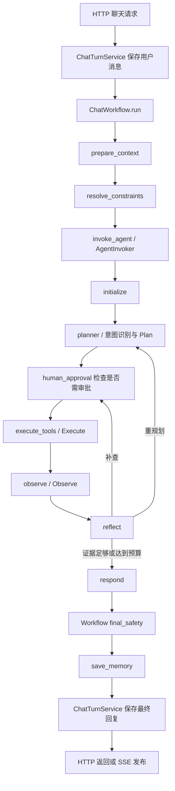

# 食谱业务完整示例与代码审阅

审阅日期：2026-09-27。本文保留当时的审阅记录；偏好/过敏统一审核的当前行为以 architecture.md 末节为准。本次修改已修复 task_context 误算证据、未消费的 safety_blocked 字段，以及知识问答被食谱模板覆盖的问题。范围：聊天入口、Workflow、Agent、工具边界、上下文与回复发布；不是全仓库每个功能的穷尽审计。本次不修改生产代码。示例菜谱和工具返回为说明性假设，不代表真实数据库内容或真实 LLM 调用结果。

## 1. 理论需求与职责边界

业务主流程是：加载用户记忆 → 合并本轮偏好和过敏限制 → 识别意图 → 将用户输入与上下文交给 Agent → Agent 推荐食谱 → Workflow 独立复核 → 保存并发布回复。

这里的 ReAct 指推理与工具行动的循环，不是前端 React 框架。当前 LangGraph 使用 planner、execute_tools、observe 实现核心节点，另有 initialize、reflect、respond 和 human_approval；节点数量超过三个本身不是冗余。

- HTTP：鉴权、请求映射、响应与 SSE。
- ChatTurnService：会话与消息事务、失败状态。
- Workflow：用户上下文、业务意图、Agent 调用和最终发布审核。
- Agent：规划工具行动、执行、观察、补查、形成候选回答。
- application/tool：工具参数协议到业务服务的适配。
- application/agent：工具注册、执行前审核、运行控制。
- application/service/composition：装配数据库、模型等具体基础设施。
- contracts：数据结构；ports：可注入行为接口。

独立是模块依赖与调用边界独立，目前不是两个独立部署的服务。Workflow 不导入 Agent 实现，通过 AgentInvoker 调用。

## 2. 一个完整的主流程示例

前置数据：用户 u1 的长期记忆中有“花生过敏”“偏好清淡”。用户输入：“今晚推荐一道含鸡蛋、30 分钟内能做好的晚餐。”以下是预期调用示例；模型选择哪一个工具、传哪些软偏好参数仍有不确定性。



### 步骤 1：建立本轮会话

`application/service/chat/chat_turn_service.py` 调用 `ChatTurnPersistence.start_turn`，在事务中创建/复用会话、保存用户问题，再构造 WorkflowRequest。同步数据库工作在线程中执行。

当前 HTTP 入口收敛为 chat 与文件 knowledge；原内部 process/process-stream 入口及 request_mapping 已删除。Agent 仍可通过应用接口独立使用。

### 步骤 2：准备上下文

`workflow/nodes/prepare_context.py` → `workflow/context/builder.py`：通过 `service/chat/conversation_history_service.py` 读取当前消息之前的历史，再处理历史窗口，加载用户长期记忆和历史摘要。硬约束不按软偏好的排名截掉。本例得到花生排除限制与清淡偏好；不存在记忆时不能假装已经知道用户过敏史。

### 步骤 3：解析本轮约束

`workflow/nodes/constraints.py` 合并长期限制、本轮文本、历史及调用方已有要求，得到分别包含过敏、禁忌和偏好的 `DietaryRequirements`；Workflow 保留独立审查快照。30分钟内等明确条件作为 required 偏好参与最终复核；普通偏好不匹配不会被当作过敏。

### 步骤 4：进入 Agent

Workflow 不再识别意图或直接回答，所有新请求进入 Agent。意图判断在下述 Agent 的 planner 阶段完成。

### 步骤 5：跨越 Workflow → Agent 边界

`InvokeAgentNode` 经 AgentInvoker.process 传递原始 message、session_id 和完整 AgentContext。AgentExecutionService 管理执行超时、并发与预算，再运行独立 Agent 图。Workflow 阶段屏蔽候选答案流，避免先展示再审核。

### 步骤 6：Agent 初始化与 Plan

`agent/orchestration/nodes/initializer/node.py` 将问题、历史、用户记忆、饮食限制、意图与偏好准备为 Agent 状态及上下文 Observation。Agent 再解析/合并约束，是支持独立调用时的防御；可共享解析函数，但不宜简单删除防护。

Planner 首次运行时通过 `agent/orchestration/nodes/planner/intent.py` 识别意图并写入状态，随后获得工具规格、问题、历史与 Observation。memory/clarify/out_of_scope 返回固定答复，其余意图进入工具规划，可能产生如下调用：

```json
{
  "tool_name": "recommend_recipes",
  "arguments": {
    "include_ingredients": ["鸡蛋"],
    "exclude_ingredients": ["花生"],
    "max_total_time_minutes": 30,
    "limit": 3
  }
}
```

这是合理示例，不是断言当前模型每次都生成这些字段。清淡偏好没有专门的 RecipeQuery 字段，能否落实依赖现有候选数据与规划策略。

### 步骤 7：Execute 与工具边界

`agent/tool_registry.py` 提供注册工具；`agent/tool_policy.py` 在执行前把花生排除约束并入参数，不能由模型随意省略。普通本地查询通过 approval 节点而不暂停；生成食谱可按配置要求审批。

调用路径：`execute_tools` → LocalToolExecutor → `application/tool/recipe_tools.py` 的 RecommendRecipesTool → RecipeService → repository 端口 → 已由 composition 注入的数据库实现。工具层负责适配，RecipeService 负责业务筛选；这不是同一个职责的重复实现。

假设正常工具返回完整食材的“番茄炒蛋”，则继续审核。若数据源仍返回含花生的候选或缺少关键食材证据，不能只信任上游已筛选的声明。

### 步骤 8：Observe 与 Reflect

Observe 将 ToolResult 整理为 Observation，并生成 Agent 内部的 safe/excluded/unknown 过滤视图。核心食谱结果保留原始结构，避免食材列表截断破坏安全证据。

Reflect 判断证据是否足够；必要时补查或重新规划，同时受调用次数、Token、成本与迭代预算限制。这是 ReAct 循环的继续/停止决策，不能因为已有 Observe 就认定 Reflect 无用。

### 步骤 9：候选回答与 Workflow 最终复核

Responder 形成候选答案。AgentExecutionService 返回结构化 recipe（若生成）、来源、状态和 evidence。Workflow 的 `final_safety` 依据原始证据重新计算结果，不信任 Agent 自己写出的安全结论。

本例存在花生限制：只有通过证据检查的候选才用于最终模板回复；不合格生成食谱会被移除，没有可用候选则降级为 insufficient_safety_evidence。具体回复文本由安全渲染器生成，不在此伪造真实运行答案。

当前实现的边界：没有 active 硬约束时，最终节点会标记 not_applicable 并返回；存在硬约束时，它对知识问答也使用食谱安全渲染，并非按意图精细审核所有回答形式。

### 步骤 10：记忆、落库与发布

SaveMemoryNode 可保存会话压缩摘要；只对符合规则的明确个人事实写长期偏好。本例含“今晚”，不会把整句当成长期偏好写入。随后 ChatWorkflow 清除内部 evidence，ChatTurnService 保存最终回复，HTTP/SSE 才向用户发布答案。

聊天回复失败时记录错误或标记本轮失败。内部 Agent HTTP 入口不承担聊天持久化，这是明确的入口差异。

## 3. 分支流程

| 用户情况 | 实际分支与限制 |
| --- | --- |
| “记住我对花生过敏” | Agent planner(memory) → respond → final_safety → save_memory；明确保存成功后才确认已保存 |
| “换一道”且没有历史 | Agent planner(clarify) → respond，不执行食谱工具 |
| “生成一道新菜” | generate → Agent 生成工具 → 结构化校验 → Workflow 复核 |
| 工具返回不安全或不完整候选 | 剔除或标为未知；无可靠候选时降级，不发布确定的安全推荐 |
| 全部食谱工具失败 | 理论上应返回明确失败；目前存在下文第 1 项状态计算缺陷 |
| 有过敏档案但只问烹饪知识 | 当前最终门禁可能改写成食谱安全答复，需补充意图区分 |

## 4. 审阅发现（按影响排序）

### 1. P1：上下文被误当成成功工具证据

位置：`application/agent/gateway/service.py` 的 actual_tool_observations 与 `agent/orchestration/nodes/initializer/node.py`。

Initializer 无条件增加 ok=True、has_data=True 的 task_context，但执行服务排除上下文工具时没有排除它。所以即便唯一真实的 recommend_recipes 工具失败，successful_evidence 仍非空，预期的 error 分支不生效，结果为 degraded/partial_evidence_unavailable。普通聊天可能据此保存为一次可发布回复；存在过敏限制时虽有后续门禁，状态统计仍不准确。

建议：显式区分上下文、真实工具证据、派生安全视图；失败判断只计算真实工具证据。这不是删除 task_context，而是修正其用途分类。

### 2. P2：直接回答分支在正常 Agent 图中不可达

位置：`application/agent/aggregation/responder.py`。

条件是 direct_answer 且 observations 为空；Initializer 已无条件加入 task_context，正常图运行中 observations 不会为空。Planner 已给出直接回答时仍再次调用 model_gateway.answer，形成无意义的额外模型调用。

建议：明确直接回答策略，在无待执行工具且允许直接作答时复用 Planner 答案；或明确取消该能力并删除相关字段/分支。不能仅把所有上下文清空来满足条件。

### 3. P2：持久化历史摘要只有加载和计数，没有模型消费闭环

位置：`workflow/context/builder.py`、`agent/orchestration/nodes/initializer/node.py`、`agent/orchestration/nodes/planner/node.py`。

MemoryContextProvider 加载的 episodic_memories 进入 AgentContext，但初始化未把它们纳入模型可见的历史或 Observation。Planner/Reflector/Responder 接口只拿到问题、历史与 Observation；计数出现在 metadata 并不等于记忆参与回答。

区别：ConversationContextWindow 当轮插入 conversation_history 的摘要是有效的；这里指独立加载的历史 episode 字段，不能把整个历史压缩模块判为无效。

建议：按 Token 预算将相关 episode 注入模型上下文，明确用户事实与摘要来源；若产品不需要跨会话摘要，再移除这条加载/存储链路。

### 4. P2：最终审核未按知识问答与推荐区分

位置：`workflow/nodes/safety.py:39` 及后面的统一渲染。

memory/clarify/out_of_scope 会跳过推荐复核，但 knowledge 不会。有硬约束的用户询问纯烹饪知识时，Agent Responder 可能先调用模型回答，Workflow 随后用食谱模板覆盖；缺少食谱候选时直接降级。此前模型回答的成本和用户真正的知识需求都可能被浪费。

建议：按输出内容和意图区分“食谱推荐审核”与“知识回答审核”，保留禁止不安全建议的要求；不能将所有 knowledge 回答无条件放行。

### 5. P3：可明确清理的未消费状态和依赖函数

- `WorkflowState.safety_blocked`：只声明和写入；当前路由、runner、响应均不读取。真正控制输出的是 result 和 safety_review。若没有计划中的消费方，删除该字段及写入即可，不能删除审核本身。
- `interfaces/http/dependencies.py` 中的 get_agent_execution_service、get_agent_context_builder：仓库内没有调用方。对应 container 方法有真实用途，必须保留；仅 HTTP 依赖包装可删除。

### 6. 低优先级合并项，不应称为无业务价值

- Agent routing 的 _after_plan 与 _after_approval 实现相同，可共用条件函数；不同节点的语义名称也有阅读价值，收益有限。
- runner 与 invoke_agent/resume_agent 双层 suppress_answer_stream 是重复防护。统一在 runner 管理可减少重复，但要明确节点是否允许脱离 runner 使用。
- runner.run/resume 重复清理 evidence、写 metadata，可抽小型输出整理函数；不值得再引入一个 Service 类。
- Workflow 与 Agent 均解析约束，可共享纯领域函数；Agent 独立运行需要保护，最终复核也必须保留。

## 5. 应保留的看似“多一层”的代码

| 代码 | 实际价值 |
| --- | --- |
| ChatTurnService 与 ChatWorkflow | 一个负责消息事务，一个负责业务流程，错误处理边界不同 |
| ChatWorkflow runner 与 graph | 一个是运行/发布边界，一个是图装配；不是两个重复业务服务 |
| AgentExecutionService | 超时、并发、状态转换、预算、checkpoint 恢复 |
| ports | 替身测试、基础设施替换和 Workflow/Agent 隔离；不是 service 实现副本 |
| 工具适配、工具注册、执行审核 | 分别解决工具调用协议、可用工具集合、每次执行的限制检查 |
| Observe 安全过滤与 Workflow 最终复核 | 前者帮助 Agent 决策，后者控制对用户发布 |
| Reflect/审批/预算 | 控制循环停止与外部操作权限；应按业务使用情况配置，而非按文件数量删除 |

## 6. 验证与建议顺序

使用本地替身模型和替身图复现（无真实模型、数据库或外部工具调用）：

1. 输入带历史 episode 的 AgentContext，初始化后的模型 Observation 不含摘要内容。
2. Planner direct_answer 与正常初始化 Observation 同时存在，Responder 仍调用 answer 模型 1 次。
3. task_context 成功、唯一真实食谱工具失败，AgentExecutionService 返回 degraded/partial_evidence_unavailable，而非 error。

前两项是未闭环/无效分支，第三项是错误业务判断，不能用“删掉多余代码”一概处理。

建议顺序：先修证据分类与失败状态 → 修直接回答分支 → 接通历史 episode → 分离知识回答审核 → 清理未使用字段和 HTTP 依赖。既有测试通过只能说明已有覆盖通过，这些复现说明还需补充对应回归测试。
